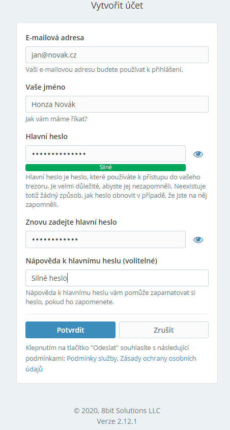
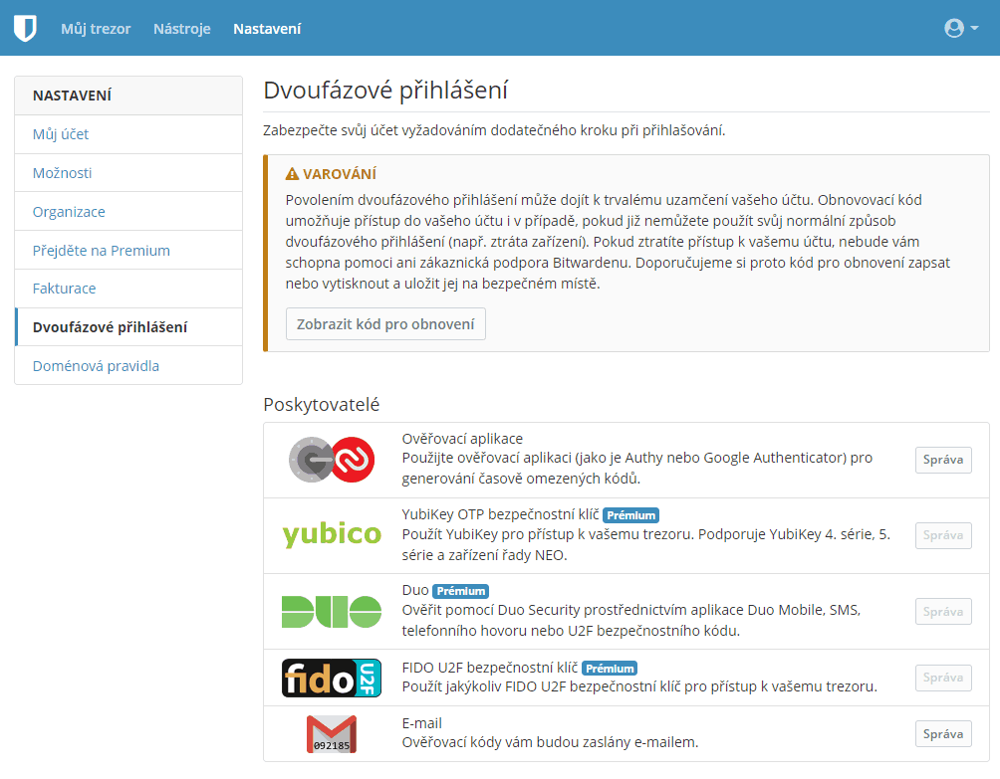
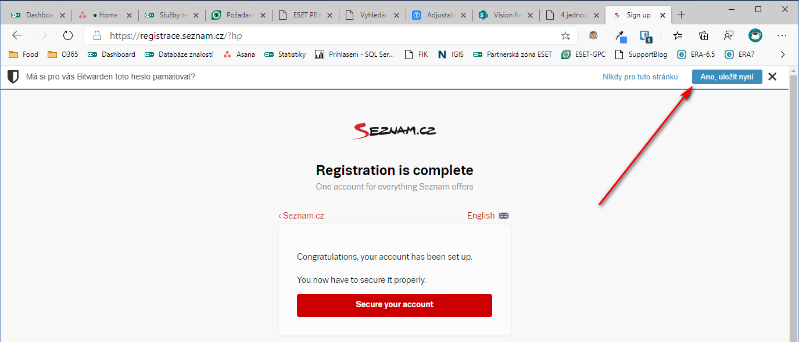
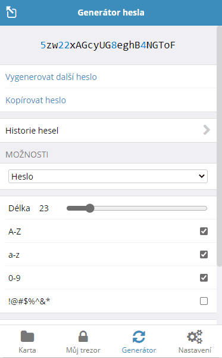

# Jak nastavit

## 2FA (Authy)

Tento návod bude (s drobnými odlišnostmi) fungovat i pro jiné aplikace (Google Authenticator, Microsoft Authenticator, Okta,...)

Potřebujete chytrý telefon s Android/iOS případně YubiKey. Aplikace do které chcete zabezpečit přístup zpravidla disponuje návodem (použijte ho), např. [Facebook](https://www.facebook.com/help/148233965247823). Nicméně můžete využít i návodu, který je k dispozici [zde](https://authy.com/guides/)

Začněte od služby, kde máte důležité věci (e-mail, sociální síť,...) a ztrátou přístupu by mohlo dojít k velké škodě. Dál už postupujte podle návodu:

* Nainstalujte si aplikaci Authy
  * Authy 2-Factor Authentication (Android)
  * Authy (iOS)
* Zaregistrujte si vaše telefonní číslo, ověřte ho (pomůže vám v případě obnovy, přenosu na nový telefon,...)
* Zálohu vyřešíme posléze, přeskočte ji (potřebovali by jste si někam poznačit heslo, vhodnější až po nastavení správce hesel)
* Klikněte v pravém dolním rohu na **+** (přidáte si tak nový účet)
* Klikněte na Scan QR Code (aplikace bude potřebovat přístup k fotoaparátu)/Opiště iniciační vektor manuálně
* Namiřte na obrazovku kde se nachází QR kód vygenerovaný službou (Facebook, Google, Microsoft,...)
* Pojmenujte si nově vytvořený účet a uložte
* Služba, kterou nastavujete bude chtít ověření (opište kód, který vám Authy generuje).

Doporučujeme nastavit zabezpečení Authy (PIN, TouchID,...).

## Správce hesel (Bitwarden)

Na webu [https://vault.bitwarden.com/#/register](Bitwardenu) se registrujte.

V sekci Nastavení si zapněte Dvoufázové přihlašování. Po kliknutí na tlačítko Správa u Ověřovací aplikace si jen spárujete svůj autentikátor v mobilu naskenováním QR kódu.

Jakmile máte účet nastaven, stáhněte si rozšíření do webového prohlížeče. Ideálně přes rozšíření/store vašeho prohlížeče, nebo přímo z [webu](https://bitwarden.com/#download) Bitwardenu, kde si vyberete svůj prohlížeč.

Pokud se na nějaké stránce registrujete poprvé, nabídne vám Bitwarden, zda chcete heslo uložit.

Bitwarden obsahuje generátor hesel. Vygeneruje jedinečné heslo (na zákldadě vaší předvolby: délka, jaké mají být použité znaky), to použijete pro danou službu a uložíte si ho. Nemusíte ho znát, správce hesel si ho pamatuje za vás.

Na mobilním telefonu či tabletu se přihlásíte stejným způsobem. Aby bylo přihlašování pro vás co nejpříjemnější, nemuseli jste pokaždé zadávat hlavní heslo, doporučuji v nastavení zapnout ověřování pomocí **FaceID** nebo **TouchID**.

Odkaz na [zdroj](https://www.spajk.cz/bitwarden-spravce-hesel-zdarma/) obrázků pro Bitwarden část.

## Mobilní zařízení

### Apple

Doporučení na stránkách [Apple](https://www.apple.com/uk/privacy/control/)

### Google

Doporučení na stránkách [Google](https://safety.google/security/security-tips/)

### Samsung

Doporučení na stránkách [Samsung](https://www.samsung.com/global/galaxy/security/)

---
[zpět](index.md)
