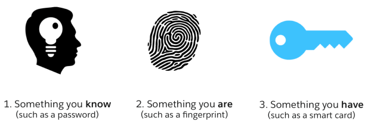

# Bezpečně : Online

Shrnutí základních principů z workshopu bezpečnosti online

## [Aktuální hrozby](threats.md)

## Sociální sítě

## [Přihlašování](login.md)

## [Slovník](slovnik.md)

## [Tahák pro online bezpečnost](online-cheetsheet.md)

## [Zdroje](links.md)
