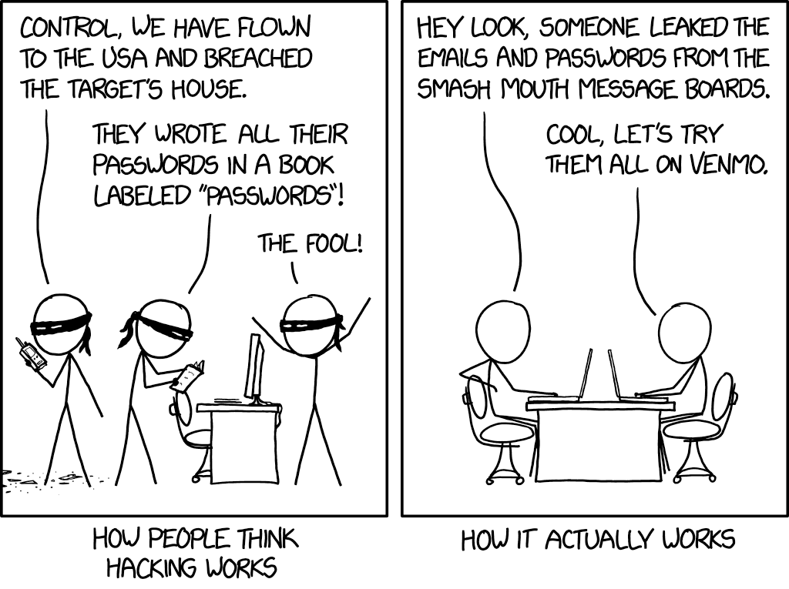

# Bezpečně : Online

Shrnutí základních principů z workshopu bezpečnosti online

## [Aktuální hrozby](_web/online/threats.md)

## Sociální sítě

## [Přihlašování](_web/online/login.md)

## [Slovník](slovnik.md)

## [Tahák pro online bezpečnost](_web/online/images/online-cheetsheet.md)

## [Zdroje](_web/online/images/links.md)
